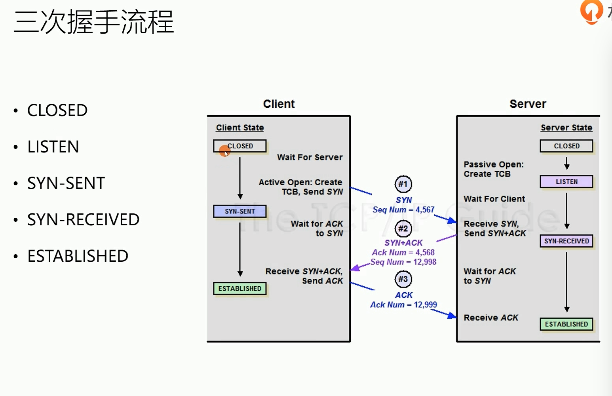

#### TCP学习记录

`TCP`是面向连接的 可靠的 基于字节流的协议

`TCP握手的目标`:
- 同步`Sequence`序列号
  初始序列号`ISN`(Initial Sequence Number) 由系统随机产生
- 交换TCP通讯参数
<!-- more -->

图片来源极客时间课程<Web协议详解与抓包实战>

`syn`攻击：只向服务器发送syn包 不发ack包 是服务器大量连接状态处于`SYN-RECEIVED`状态 消耗资源
`ISN` 
